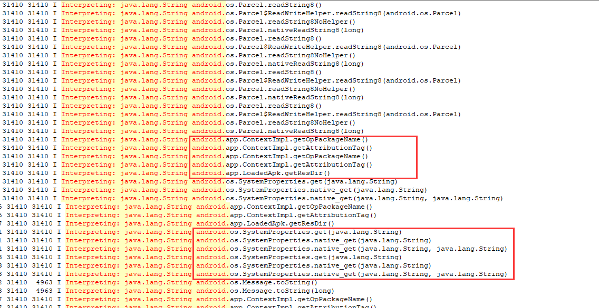

## 背景

&emsp;&emsp;[Apolo插件](https://github.com/WaxMoon/ApoloPlugin)提供了一些轻量级art hook接口，并且已经发布到[maven central](https://search.maven.org/)，接入非常方便。将来也会提供更多的周边功能，其目的是为了帮助大家逆向/安全分析，app合规检测等。

&emsp;&emsp;鉴于trace功能带来的严重卡顿，可能使某些应用黑屏时间过长、anr、闪退，所以急切需要过滤功能。如果您有此需求，可以使用0.0.5版本。

## 参考文档

[项目主页](https://github.com/WaxMoon/ApoloPlugin/blob/main/README-zh-CN.md)

## trace过滤功能接入说明

**前提**: 如果您不知道如何使用apolo开启trace功能，那么您可以先翻阅一下[Apolo插件实战-dex反优化后trace代码](docs/Apolo%E6%8F%92%E4%BB%B6%E5%AE%9E%E6%88%98-dex%E5%8F%8D%E4%BC%98%E5%8C%96%E5%90%8Etrace%E4%BB%A3%E7%A0%81.md)

### 使用正则表达式进行trace 过滤

非常简单, 您只需要在开启trace的前提下，调用ArtEngine.setInterpretFilterRegex接口即可

```Java

        //split ','
        ArtEngine.setInterpretFilterRegex("android.app.*,android.os.*");

        ...
        ...
        //trace
        ArtEngine.enableInterpretLog();
        ArtEngine.setHookMode(ArtEngine.MODE_INTERPRET);
        ArtEngine.startHook();

```
上述demo中传入了android.app.*以及android.os.*，多个正则表达式用逗号分割开来，最终log中只会打印与正则相匹配的method。

log效果截图
