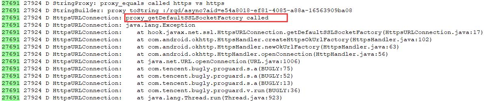
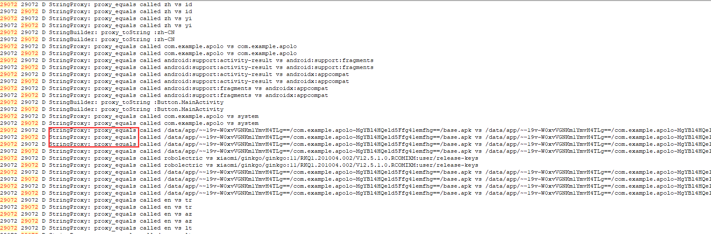
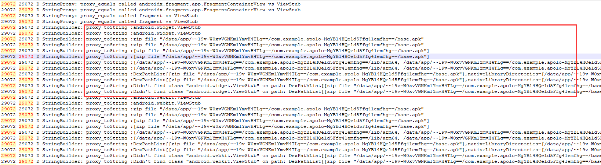
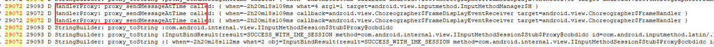
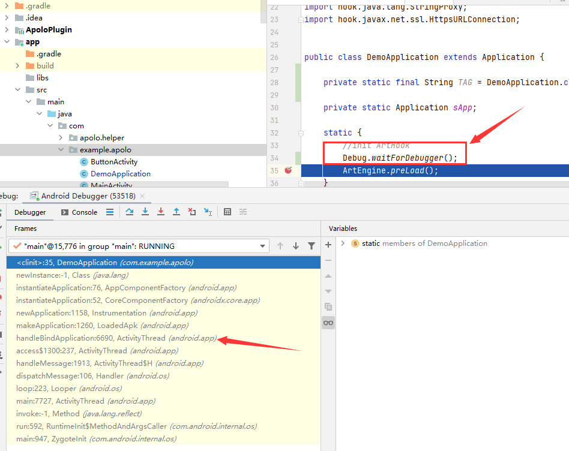
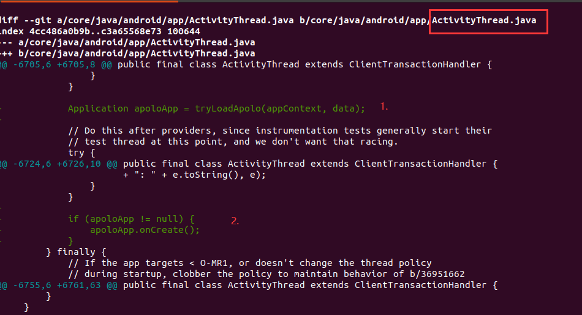
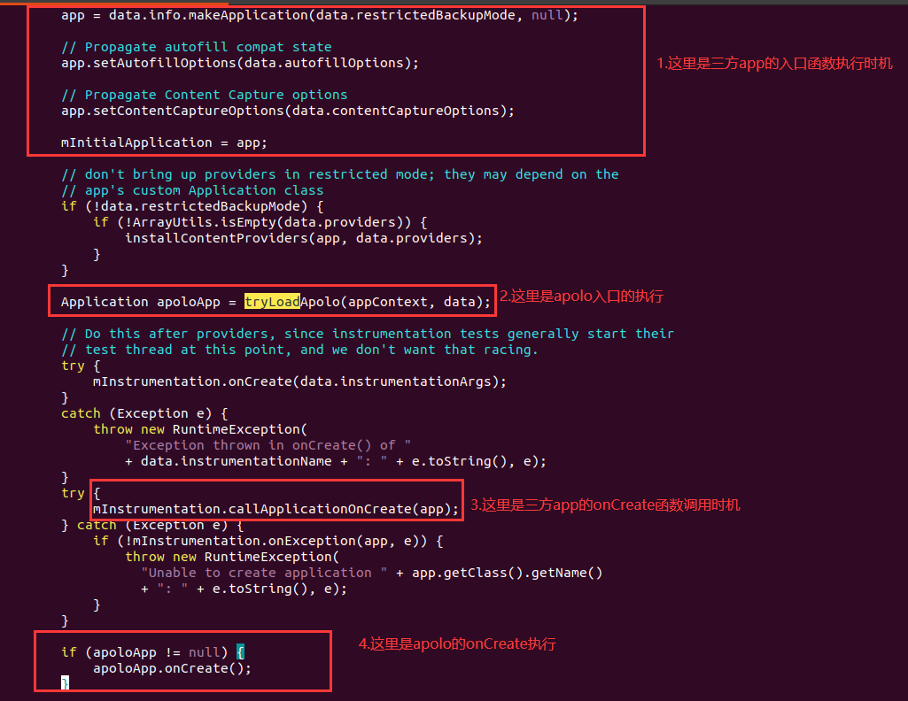
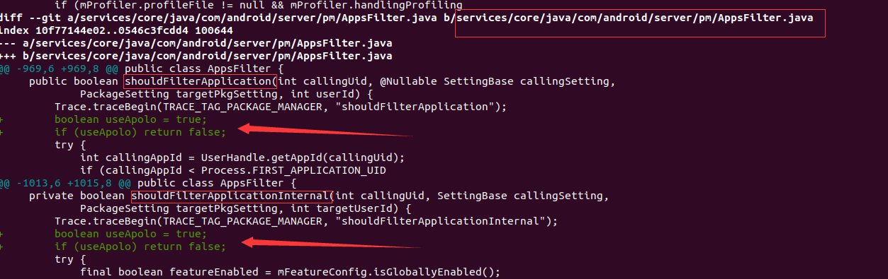

## 背景

&emsp;&emsp;[Apolo插件](https://github.com/WaxMoon/ApoloPlugin)提供了一些轻量级art hook接口，并且已经发布到[maven central](https://search.maven.org/)，接入非常方便。将来也会提供更多的周边功能，其目的是为了帮助大家逆向/安全分析，app合规检测等。

&emsp;&emsp;但是没有一套好用的安卓环境，功能再多，也无法施展拳脚。可能大家比较熟悉xposed、frida等手段，但是各大厂商已经将其视为眼中钉肉中刺。运气不好的话，你可能需要花非常多的时间解决反外挂，反调试，root环境检测等问题(i茅台气人不^~^)。

&emsp;&emsp;今天，给大家带来ApoloPlugin模块，如何定制到ROM环境去分析app的行为。

## 直接使用ApoloROM仓库的补丁编译ROM

&emsp;&emsp;patch已经放在了[ApoloROM](https://github.com/WaxMoon/ApoloROM)仓库中，但是目前只提供了aosp-android11分支。如果您的ROM是其他分支，同样也适用，因为代码短小简单, 可以直接拷贝使用。

打补丁时，您需要将补丁放到对应的git目录下，比如放至frameworks/base并执行如下命令

    patch -p1 < xxx.patch

如果您不清楚如何编译ROM，可查看[相关教程](https://blog.csdn.net/lzz137/article/details/118526642?spm=1001.2014.3001.5502)

## 定制ROM效果

### 随便安装一个app(比如i茅台)并打开，观察log

下述log中apolo插件初始化成功，并开始hook

```
3129  3129 D ApoloModule: ====begin load apolo->com.example.apolo for com.moutai.mall
3129  3129 D ApoloEngine: preLoad success!
3129  3129 D ApoloModule: load apolo success
3129  3129 D ArtHookInternal: addHooker: java.lang.String.equals
3129  3129 D ArtHookInternal: addHooker: java.lang.StringBuilder.toString
3129  3129 D ArtHookInternal: addHooker: java.io.File.mkdir
3129  3129 D ArtHookInternal: addHooker: android.os.Process.killProcess
3129  3129 D ArtHookInternal: addHooker: android.os.Handler.sendMessageAtTime
3129  3129 D ArtHookInternal: addHooker: android.app.ActivityThread.currentActivityThread
3129  3129 D ArtHookInternal: addHooker: android.app.ApplicationPackageManager.getInstalledPackages
3129  3129 D ArtHookInternal: addHooker: android.app.ContextImpl.getSystemService
3129  3129 D ArtHookInternal: addHooker: hook.Test.test
3129  3129 D ArtHookInternal: addHooker: javax.net.ssl.HttpsURLConnection.getDefaultSSLSocketFactory
3129  3129 D ArtHookInternal: addHooker: javax.net.ssl.HttpsURLConnection.setHostnameVerifier
3129  3129 D ArtHookInternal: addHooker: javax.net.ssl.HttpsURLConnection.setSSLSocketFactory
```

### 通过log，确认hook已经生效

#### hook log->javax.net.ssl.HttpsURLConnection.getDefaultSSLSocketFactory



#### hook log->java.lang.String.equals


#### hook log->java.lang.StringBuilder.toString



#### hook log->android.os.Handler.sendMessageAtTime



## 定制ROM的思路

&emsp;&emsp;我们要明确定制ROM的目的是什么: 注入到app进程并初始化Apolo相关逻辑

### 1.注入进程

&emsp;&emsp;这里我们不需要再大刀阔斧谈论ptrace进程注入手段了，aosp源码都有，直接代码开搞。我们只需要在进程起来的时候，看准时机，找准位置，初始化插件代码就完事。

&emsp;&emsp;做安卓的童鞋，可能都清楚这一点: app的入口就是AndroidManiest.xml中声明的application。我们能否在aosp源码中，找到调用该入口的代码位置呢。

&emsp;&emsp;非常简单，您只需要写个超级简单的android DEMO，并在Application的静态代码段中写个Debug.waitForDebugger, 在下一行代码处打个断点。运行demo后，attach该进程，在debug试图中就可以清楚的看到调用堆栈了。当然，你也可以通过new Exception()打印堆栈。
```Java
public class DemoApplication extends Application {

    private static final String TAG = DemoApplication.class.getSimpleName();

    private static Application sApp;

    static {
        //init ArtHook
        Debug.waitForDebugger();
        ArtEngine.preLoad();
    }
    ...
    ...
}
```



**该处堆栈中，本人选择了handleBindApplication作为切入点**

### 2.在handleBindApplication初始化Apolo



图中共有两处代码：

* 执行tryLoadApolo获取Apolo插件的Application
* 主动调用ApoloApp.onCreate函数

#### tryLoadApolo函数

下述代码，通过数字标注了关键点

* 1.通过Settings获取Apolo包名

        由于系统默认没有缓存pkg.apolo，所以获取到的Apolo包名为null，所以设置了com.example.apolo为默认包名。您也可以通过adb shell settings put global pkg.apolo xxx，设置您自己的包名
* 2.过滤apolo包自身，过滤掉系统app

* 3.通过PackageManager获取apolo的ApplicationInfo

        这里某些情况下可能会返回null: 1)您要确保安装了apolo包 2)确认三方app进程完全kill 3)安卓系统版本可能会有过滤的情况，后续会介绍方案.

* 4.修改apolo的AppilicationInfo

        apolo包带有64/32位，但是三方app可能只有32位的情况，这时候就需要修复ApplicationInfo，否则加载libapolo.so会失败

* 5.调用LoadedApk.makeApplication，执行apolo插件的入口相关函数

```Java
    private final Application tryLoadApolo(Context mainAppContext, AppBindData data) {
        if (mainAppContext == null) {
            throw new RuntimeException("mainAppContext is null");
        }

        final String APOLO_TAG = "ApoloModule";

        //1.这里是通过Settings获取apolo包名-------
        final ContentResolver resolver = mainAppContext.getContentResolver();
        String apoloPkg = Settings.Global.getString(resolver, "pkg.apolo");
        if (apoloPkg == null) {
            //1.1如果Settings没找到，默认使用该包名-------
            apoloPkg = "com.example.apolo";
        }

        //2.--------
        /*******过滤apolo自身以及系统app*******/
        if (Objects.equals(data.appInfo.packageName, apoloPkg)
                || data.appInfo.isSystemApp()
                || data.appInfo.isPrivilegedApp()) {
            Log.d(APOLO_TAG, "No need to load apolo for " + data.appInfo.packageName);
            return null;
        }
    
        Application apoloApp = null;
        ApplicationInfo apoloInfo = null;
        try {
            //3.获取apolo插件的ApplicationInfo--------
            apoloInfo = mainAppContext.getPackageManager()
                    .getApplicationInfo(apoloPkg, 0);
        } catch (Exception e) {
            Log.e(APOLO_TAG, "load failed for apolo pkg not found", e);
        }
        if (apoloInfo != null) {
            //4--------
            /*************fix Apolo abi**************/
            final String runtimeInstruction = VMRuntime.getCurrentInstructionSet();
            if (Objects.equals(runtimeInstruction, "arm")) {
                apoloInfo.nativeLibraryRootDir = apoloInfo.sourceDir + "!/lib/";
                apoloInfo.nativeLibraryDir = apoloInfo.sourceDir + "!/lib/armeabi-v7a";
                apoloInfo.primaryCpuAbi = "armeabi-v7a";
            }

            final LoadedApk apoloApk = getPackageInfoNoCheck(apoloInfo, data.compatInfo);

            try {
                //5.执行Apolo的入口Application.attachBaseContext
                apoloApp = apoloApk.makeApplication(data.restrictedBackupMode, null);
            } catch (Exception e) {
                Log.e(APOLO_TAG, "make apolo application fail", e);
            }

        }

        if (apoloApp != null) {
            Log.d(APOLO_TAG, "\033[1;32mload apolo success\033[0m");
        }
        return apoloApp;
    
    }
```

#### tryLoadApolo函数插入到哪里?



## 安装Apolo包提供hook等功能

### 1.可以拉取[ApoloPlugin](https://github.com/WaxMoon/ApoloPlugin)最新代码，编译app模块安装到手机
    包名为com.example.apolo，与ROM中的包名一致，编译后只需安装到手机即可

### 2.也可以在build.gradle中依赖ApoloPlugin模块，自定义包名
    由于自定义包名，所以您需要执行adb shell settings put global pkg.apolo xxx，其中xxx需要修改为您的包名

**注意:** ApoloPlugin相关版本号必须>=**0.0.2**

### 建议将framework的app过滤功能patch掉，否则apolo包有找不到的情况
**代码位置**:

    frameworks/base/services/core/java/com/android/server/pm/AppsFilter.java->shouldFilterApplication




## 欢迎加入Apolo交流群

