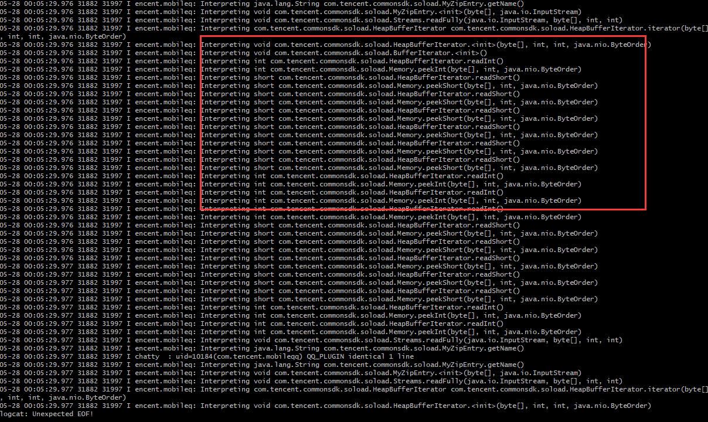

## 背景

&emsp;&emsp;[Apolo插件](https://github.com/WaxMoon/ApoloPlugin)提供了一些轻量级art hook接口，并且已经发布到[maven central](https://search.maven.org/)，接入非常方便。将来也会提供更多的周边功能，其目的是为了帮助大家逆向/安全分析，app合规检测等。

&emsp;&emsp;今天，给大家带来ApoloPlugin模块新功能，dex反优化trace java层代码执行流程。

## 参考文档

[项目主页](https://github.com/WaxMoon/ApoloPlugin/blob/main/README-zh-CN.md)

[Apolo插件实战-ROM环境注入app分析其行为](https://github.com/WaxMoon/ApoloPlugin/blob/main/docs/Apolo%E6%8F%92%E4%BB%B6%E5%AE%9E%E6%88%98-ROM%E7%8E%AF%E5%A2%83%E6%B3%A8%E5%85%A5app%E5%88%86%E6%9E%90%E5%85%B6%E8%A1%8C%E4%B8%BA.md)

## dex反优化trace使用场景

* app加固，脱壳困难? 通过trace分析程序流
* 不清楚对一款app如何下手? 通过trace找切入点
* app是否有不合规调用? 通过trace抓取log，分析log即可
* 入门学习安卓framework，会有些许帮助

## 如何开启trace

**注意**:trace功能在ApoloPlugin:0.0.4版本才引入

### 第一步:必须调用ArtEngine.setHookMode

```Java
    @IntDef({
            MODE_SIMPLE,
            MODE_TRAMPOLINE,
            MODE_INTERPRET
    })
    public @interface MODE {}
    public static final int MODE_SIMPLE = 0x1;
    public static final int MODE_TRAMPOLINE = 0x1 << 1;
    public static final int MODE_INTERPRET = 0x1 << 2;

    public static void setHookMode(@MODE int mode) {
        sInterpretMode = mode;
    }
```


#### HookMode属性
您可以修改HookMode为simple、trampo、interpret三种模式，分别对应三种场景:

1) simple: 如果您只需要关注app是否调用了系统api，此模式已够用
2) trampo: 此模式暂时先不支持，还有些许问题，比如性能
3) interpret: 解释执行模式，逆向hook/trace等场景使用

### 第二步:调用ArtEngine.enableInterpretLog函数
可以设置为ON、OFF两种选择。当为ON时，adb log会有大量log。

**友情提醒:** 会造成app卡顿比较严重

## 案例-trace某讯聊天软件




